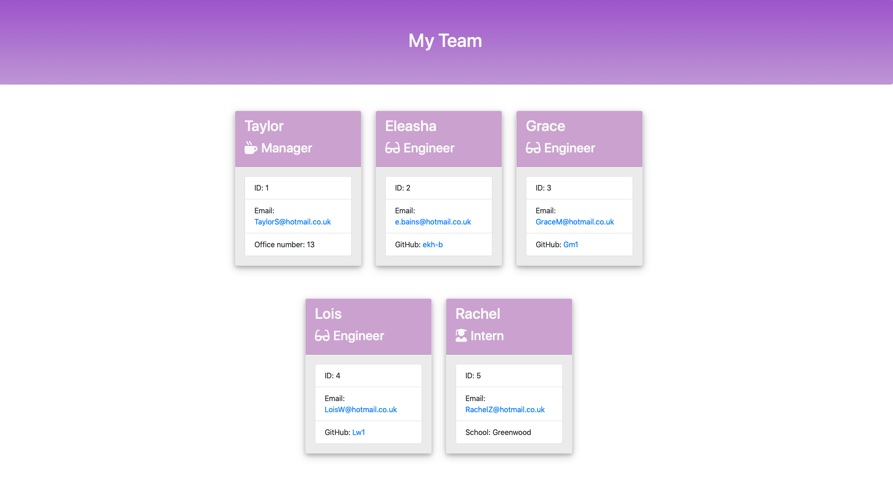

# team-profile-generator

## Description

An application that generates an HTML webpage of a team profile, using input from a command-line interface.

[Here is a sample page from this application](https://ekh-b.github.io/team-profile-generator/assets/Sample.html)

## Installation

Following installations are required in order to use this application:

- Install node (https://nodejs.org/en/download) -If homebrew is already installed run command ***brew install node@16***)
- Install filing system node module
- Install inquirer: ***init-y*** followed by ***npm install --save inquirer@^8.0.0***
- Install jest

See my package.json file to ensure you have installed the correct dependencies.

## Usage

- To run the tests use command 'npm run test'.

- To generate a team profile use command 'node index.js' and follow the instructions in the console.

Below is an example of what this application generates:

## Credits/ Resources used

https://www.w3schools.com/css/css3_gradients.asp

https://www.w3schools.com/css/css3_shadows_box.asp

https://www.w3schools.com/js/js_switch.asp

https://developer.mozilla.org/en-US/docs/Web/JavaScript/Reference/Functions/Arrow_functions

## License

[MIT](https://choosealicense.com/licenses/mit/)
---